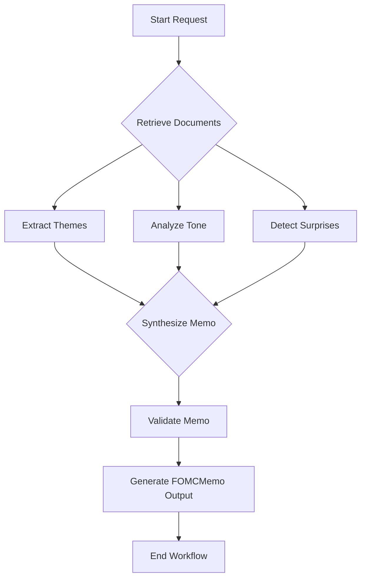

id: 696821ab7084f382f717550c_documentation
summary: FOMC Research Agent Documentation
feedback link: https://docs.google.com/forms/d/e/1FAIpQLSfWkOK-in_bMMoHSZfcIvAeO58PAH9wrDqcxnJABHaxiDqhSA/viewform?usp=sf_link
environments: Web
status: Published
# QuLab: FOMC Research Agent - Developer Guide

## 1. Introduction to QuLab: FOMC Research Agent
Duration: 0:05:00

Welcome to the developer guide for QuLab: FOMC Research Agent! This codelab provides a comprehensive walkthrough of the Streamlit application, designed to transform complex Federal Open Market Committee (FOMC) communications into structured, auditable investment research.

<aside class="positive">
This application is crucial for Quantitative Analysts and financial researchers who need to quickly and consistently derive actionable insights from verbose economic documents. By automating the extraction of key themes, tone analysis, and policy surprises, it significantly reduces manual effort and improves decision-making speed.
</aside>

### Application Overview

The QuLab application leverages advanced Large Language Models (LLMs) and a multi-agent workflow orchestrated by LangChain/LangGraph to process FOMC documents. It then presents the extracted information in a structured format, enabling human review and approval, and tracks historical trends.

**Core Concepts Explained:**

*   **Multi-Agent Workflow**: The application orchestrates several specialized "agents" (e.g., a Document Loader, an Analyst Agent, a Validator Agent) that collaborate to achieve the analysis goal. This modular approach enhances reliability and maintainability.
*   **Retrieval Augmented Generation (RAG)**: To ensure accuracy and reduce hallucinations, the LLMs retrieve relevant information directly from the source FOMC documents. This is crucial for generating citations.
*   **Structured Data Output**: All extracted information (themes, tone, surprises, citations) is presented in a highly structured, machine-readable format using Pydantic models. This allows for programmatic analysis and integration with other systems.
*   **Human-in-the-Loop Workflow**: Recognizing the criticality of financial research, the application includes a robust review and approval process, allowing human experts to validate, revise, or reject AI-generated analyses.
*   **Transparency and Auditability**: Every step of the analysis, including LLM prompts, intermediate thoughts, and final outputs, is logged, providing a full audit trail for compliance and debugging.
*   **Historical Analysis and Trend Tracking**: The application stores historical analyses, enabling users to track changes in FOMC tone, evolving themes, and policy impacts over time.

### High-Level Architecture

The application follows a client-server architecture where Streamlit acts as the front-end, and the backend logic (LLM orchestration, data handling) resides primarily in Python.

Here's a simplified block diagram illustrating the main components:

```mermaid
graph TD
    A[Streamlit UI] --> B(app.py - Frontend Logic & Routing)
    B --> C(source.py - Backend Logic & Agents)
    C --> D[LLM APIs (e.g., OpenAI, Anthropic)]
    C --> E[Vector Database (ChromaDB)]
    C --> F[Data Models (Pydantic)]
    C --> G[Session & Audit Management]
    E -- RAG --> C
    D -- LLM Responses --> C
    C -- Structured Data --> B
    B -- Display --> A
```

**Description of Components:**

*   **Streamlit UI**: The interactive web interface where users initiate analyses, review memos, and view history.
*   **`app.py`**: The main Streamlit script handling UI components, session state, page navigation, and orchestrating calls to the backend logic.
*   **`source.py`**: Contains the core business logic, including:
    *   **Data Ingestion**: Loading and processing FOMC documents.
    *   **Multi-Agent Workflow**: Orchestrating LLM interactions using LangChain/LangGraph.
    *   **Pydantic Data Models**: Defining the structure of input and output data.
    *   **Utility Functions**: For data retrieval, state management, and plotting.
*   **LLM APIs**: External services (e.g., OpenAI's GPT models) that perform the natural language understanding, generation, and reasoning tasks.
*   **Vector Database (ChromaDB)**: Stores document embeddings, enabling efficient semantic search (RAG) to find relevant document snippets for the LLMs.
*   **Data Models (Pydantic)**: Ensures that all data exchanged between agents and displayed in the UI is structured and validated, crucial for reliability.
*   **Session & Audit Management**: A custom component (`SessionStateManager`) to persist ongoing workflow states, request history, and detailed execution logs.

## 2. Setting Up the Development Environment
Duration: 0:08:00

Before you can run and develop the QuLab application, you need to set up your environment.

### Prerequisites

*   **Python**: Version 3.9 or higher.
*   **pip**: Python package installer (usually comes with Python).
*   **Git**: For cloning the repository.
*   **API Keys**: Access to OpenAI or Anthropic API is required for LLM functionality.

### 2.1. Clone the Repository

First, clone the repository to your local machine.
<button>
  [Download App Code](https://github.com/your-repo/fomc-research-agent.git) <!-- Placeholder URL -->
</button>

```bash
git clone https://github.com/your-repo/fomc-research-agent.git
cd fomc-research-agent
```

### 2.2. Create a Virtual Environment and Install Dependencies

It's best practice to use a virtual environment to manage dependencies.

```bash
python -m venv venv
source venv/bin/activate # On Windows, use `venv\Scripts\activate`
pip install -r requirements.txt
```

<aside class="negative">
Ensure `requirements.txt` is up-to-date and includes all necessary libraries such as `streamlit`, `langchain`, `langgraph`, `openai`, `anthropic`, `chromadb`, `pydantic`, `plotly`, `asyncio`, etc. If any are missing, install them manually using `pip install <package-name>`.
</aside>

### 2.3. Configure API Keys

The application requires API keys for the LLM providers. Set these as environment variables.

```bash
export OPENAI_API_KEY="your_openai_api_key_here"
export ANTHROPIC_API_KEY="your_anthropic_api_key_here"
# You might also need specific keys for other services if integrated,
# e.g., GOOGLE_API_KEY, TAVILY_API_KEY if using search tools
```

Alternatively, you can create a `.env` file in the root directory:

```
OPENAI_API_KEY="your_openai_api_key_here"
ANTHROPIC_API_KEY="your_anthropic_api_key_here"
```

And then load them in your `source.py` or `app.py` using `python-dotenv`. For this codelab, we assume environment variables are set.

### 2.4. Run the Streamlit Application

Once dependencies are installed and API keys are set, you can launch the application:

```bash
streamlit run app.py
```

This command will open the application in your default web browser (usually `http://localhost:8501`).

<aside class="positive">
The first time you run the application, it will display an "Loading initial FOMC documents (this may take a moment)..." message. This is because the application asynchronously calls `main_ingestion()` to load and process the initial set of FOMC documents into the vector database. This step is critical for the RAG functionality.
</aside>

## 3. Understanding the Application Structure and Core Components
Duration: 0:10:00

The application is primarily split into `app.py` (Streamlit UI) and `source.py` (backend logic, data models, agents).

### 3.1. `app.py`: The Streamlit Frontend

`app.py` is responsible for:
*   **Page Configuration**: `st.set_page_config` sets the title, layout, and sidebar state.
*   **CSS Styling**: Custom CSS enhances the visual appeal with a dark theme and custom component styles.
*   **Session State Management**: Streamlit's `st.session_state` is extensively used to maintain application state across reruns, crucial for navigation, workflow progress, and storing user selections.
*   **Asynchronous Initialization**: It handles the initial asynchronous loading of FOMC documents (`initialize_fomc_documents` using `asyncio.create_task`).
*   **Sidebar Navigation**: Buttons in the sidebar control which page function (`render_home`, `render_new_analysis`, etc.) is called.
*   **Page Rendering Functions**: Each main functionality (Home, New Analysis, Review, History, Settings) has a dedicated `render_` function.
*   **Dynamic UI Updates**: Displays progress bars, status messages, and data based on ongoing workflows or stored state.

#### Key Session State Variables:
*   `st.session_state.current_page`: Tracks the active page.
*   `st.session_state.workflow_state`: Stores detailed state of ongoing analysis requests.
*   `st.session_state.request_history`: A list of all initiated analysis requests.
*   `st.session_state.current_request_id`: The ID of the currently active request.
*   `st.session_state.latest_memo_data`: Stores the `FOMCMemo` object of the most recently generated analysis for preview.
*   `st.session_state.fomc_documents_initialized`: A flag to ensure document ingestion only runs once.

### 3.2. `source.py` (Conceptual): The Backend Logic

The `source.py` file (or equivalent backend module) is where the core intelligence resides. Based on the `app.py` code, we can infer its critical contents:

*   **`main_ingestion()`**: An `async` function responsible for loading, parsing, chunking, and embedding FOMC documents into a vector store (likely ChromaDB).
*   **Pydantic Data Models**: Defines the structured output of the LLM agents. Examples from `app.py` include `FOMCMemo`, `Theme`, `ToneAnalysis`, `Citation`, `ValidationReport`, `ConfidenceAssessment`, `ReviewAction`, `AgentState`, etc. These models enforce data schema and validation.
*   **`SessionStateManager`**: A class to manage the persistence and retrieval of application state, particularly for tracking workflow progress and audit trails across requests.
*   **`create_fomc_workflow()`**: This function, likely using LangGraph, defines the multi-agent orchestration for the FOMC analysis. It outlines the sequence of steps, agents, and tools involved.
*   **Utility Functions**:
    *   `get_fomc_meeting_dates()`: Retrieves available FOMC meeting dates.
    *   `check_document_availability()`: Verifies if documents for a specific meeting are loaded.
    *   `get_pending_review_count()` / `get_pending_reviews()`: For the review workflow.
    *   `load_memo()`: Loads a specific `FOMCMemo` from persistence.
    *   `update_memo_status()`: Updates the status of a memo after review.
    *   `render_tone_trajectory()` / `render_citation_network()`: Plotting functions.
    *   `mock_prior_tone_scores`: Placeholder data for historical analysis.

### 3.3. Pydantic Models for Structured Data

Pydantic models are used extensively to define clear, validated data structures for the output of the LLM agents. This is vital for consistency and ease of downstream processing.

Example (in `source.py`):

```python
# Example Pydantic models (conceptual, based on app.py usage)
from pydantic import BaseModel, Field
from datetime import date, datetime
from typing import List, Optional, Literal

class Citation(BaseModel):
    document_id: str = Field(..., description="ID of the source document.")
    section_id: Optional[str] = Field(None, description="Section within the document.")
    paragraph_number: Optional[int] = Field(None, description="Paragraph number.")
    quote: str = Field(..., description="The exact quote from the document.")

class Theme(BaseModel):
    theme_name: str = Field(..., description="Name of the key theme.")
    description: str = Field(..., description="Detailed description of the theme.")
    keywords: List[str] = Field(..., description="Keywords associated with the theme.")
    confidence: float = Field(..., description="Confidence score (0.0-1.0) in theme extraction.")
    citations: List[Citation] = Field(..., description="Supporting citations from source documents.")

# ... and many more for ToneAnalysis, Surprise, ValidationReport, FOMCMemo, etc.
```

## 4. Data Ingestion and Document Management
Duration: 0:07:00

The first critical step for the QuLab agent is to ingest and manage the raw FOMC documents. This process enables the Retrieval Augmented Generation (RAG) capabilities of the LLM workflow.

### 4.1. The `main_ingestion()` Function

When the application starts, it attempts to load and process FOMC documents via `initialize_fomc_documents`, which in turn calls `main_ingestion()`.

<aside class="positive">
This asynchronous loading prevents the Streamlit UI from blocking, providing a smoother user experience, especially during the initial setup.
</aside>

```python
# app.py snippet for initialization
if not st.session_state.fomc_documents_initialized:
    if "fomc_loading_task" not in st.session_state or (st.session_state.fomc_loading_task and st.session_state.fomc_loading_task.done()):
        st.session_state.fomc_loading_task = asyncio.create_task(initialize_fomc_documents())
    st.info("Loading initial FOMC documents...")
    st.stop() # Stop further execution until documents are loaded (or task completes and reruns)

# source.py (conceptual)
async def main_ingestion() -> List[Dict[str, Any]]:
    # 1. Load raw FOMC documents (e.g., from a directory or API)
    #    This might involve scraping, reading PDFs, or fetching from a data lake.
    raw_documents = load_raw_fomc_docs() 

    # 2. Split documents into manageable chunks
    #    LangChain's RecursiveCharacterTextSplitter is a common choice.
    text_splitter = RecursiveCharacterTextSplitter(chunk_size=1000, chunk_overlap=200)
    chunked_documents = text_splitter.split_documents(raw_documents)

    # 3. Create embeddings for each chunk
    #    Using an embedding model (e.g., OpenAIEmbeddings, SentenceTransformers).
    embeddings_model = OpenAIEmbeddings()

    # 4. Store chunks and their embeddings in a vector database
    #    ChromaDB is used here for simplicity and local persistence.
    vectorstore = Chroma.from_documents(
        documents=chunked_documents,
        embedding=embeddings_model,
        persist_directory="./chroma_db" # Or an in-memory instance
    )
    vectorstore.persist() # Save the database to disk

    # 5. Return metadata or identifiers of loaded documents
    #    This allows the application to track what's available.
    loaded_docs_metadata = extract_metadata(chunked_documents)
    return loaded_docs_metadata
```

### 4.2. Document Availability Checks

The application provides functions to interact with the loaded documents:

*   **`get_fomc_meeting_dates(start, end)`**: This function queries the document store to find all available FOMC meeting dates within a specified range. It's used to populate the `selectbox` on the "New Analysis" page.
*   **`check_document_availability(meeting_date)`**: For a given `meeting_date`, this function checks if all expected document types (e.g., `statement`, `minutes`, `press_conference`) are present in the vector store. This helps users understand if a complete analysis is possible.

These functions typically interact with the metadata stored alongside the document chunks in the vector database or a separate index.

```python
# source.py (conceptual)
def get_fomc_meeting_dates(start: date, end: date) -> List[date]:
    # Query vector store or metadata index for unique meeting dates
    # Example: filter documents by date and extract unique dates
    all_dates = [] # Populate from ChromaDB or a dedicated metadata store
    return sorted(list(set(all_dates)), reverse=True)

def check_document_availability(meeting_date: date) -> Dict[str, bool]:
    # Check if 'statement', 'minutes', 'press_conference' for meeting_date exist
    docs_found = {
        "statement": False,
        "minutes": False,
        "press_conference": False
    }
    # Logic to query vector store or metadata index
    # Example: vectorstore.similarity_search_with_score(query, filter={"date": meeting_date, "type": "statement"})
    return docs_found
```

## 5. Initiating a New FOMC Analysis
Duration: 0:12:00

The "New Analysis" page (`render_new_analysis`) is where users initiate a fresh analysis of FOMC meeting materials. This section details how the analysis workflow is triggered and managed.

### 5.1. User Input and Options

The UI allows users to specify key parameters for the analysis:

*   **Meeting Date Selection**: A `st.selectbox` populated by `get_fomc_meeting_dates()` allows selection of a specific FOMC meeting.
*   **Available Documents**: `check_document_availability()` provides a visual cue on which documents are present for the selected meeting.
*   **Analysis Options**:
    *   `Include Historical Context`: Compares the current meeting to previous ones for tone shifts.
    *   `Number of Themes to Extract`: Defines the granularity of theme extraction.
    *   `Auto-Validate Citations`: Automatically verifies if generated citations are grounded in source text.
    *   `Minimum Confidence Threshold`: Filters output to only include highly confident extractions.

```python
# app.py snippet
st.markdown(f"### Select FOMC Meeting")
available_meetings = get_fomc_meeting_dates(start=date(2020, 1, 1), end=date.today())
selected_meeting = st.selectbox(...)

st.markdown(f"### Analysis Options")
include_historical_context = st.checkbox(...)
num_themes_to_extract = st.slider(...)
auto_validate_citations = st.checkbox(...)
minimum_confidence_threshold = st.slider(...)
```

### 5.2. Triggering the Workflow

When the "🚀 Start Analysis" button is clicked, an asynchronous task (`run_analysis_workflow()`) is created, and the Streamlit app reruns.

```python
# app.py snippet
if selected_meeting and st.button("🚀 Start Analysis", type="primary", use_container_width=True, key="start_analysis_button") and st.session_state.active_workflow_task is None:
    request_id = session_manager.start_request(selected_meeting)
    st.session_state.current_request_id = request_id
    
    # ... progress bar and status text initialization ...

    st.session_state.active_workflow_task = asyncio.create_task(run_analysis_workflow())
    st.rerun()
```

### 5.3. The `run_analysis_workflow()` Function

This asynchronous function orchestrates the entire analysis using the LangGraph workflow defined in `create_fomc_workflow()`.

```python
# app.py snippet
async def run_analysis_workflow():
    workflow = create_fomc_workflow() # from source.py
    initial_state = AgentState(
        meeting_date=selected_meeting,
        request_id=request_id,
        requested_at=datetime.now(),
        config={ ... } # Pass user-selected options
    )

    step_count = 0
    total_steps = 10 # Estimated total steps in the workflow

    try:
        # Using astream_events for real-time progress updates
        async for event in workflow.astream_events(initial_state, {"configurable": {"thread_id": request_id}}, version="v1"):
            event_type = event["event"]
            current_node = None 

            if event_type == "on_chain_start" or event_type == "on_tool_start" or event_type == "on_agent_action":
                current_node = event["name"] 

            if current_node: 
                step_count += 1
                progress = min(step_count / total_steps, 0.95)
                progress_bar.progress(progress, text=f"Running: **{current_node.replace('_', ' ').title()}**")
                status_text.markdown(f"Current Step: `{current_node}`")
                with log_container:
                    st.markdown(f"✓ Started: `{current_node}`")
                
                # Store detailed events in session_manager for audit trail
                session_manager.update_step(request_id, current_node, event)
            
            if event_type == "on_chain_end" and event["name"] == "workflow":
                 final_state = event["data"]["output"]["output"]

        # ... Update request history and latest memo data ...

    except Exception as e:
        # ... Error handling ...
    finally:
        st.session_state.active_workflow_task = None
```

*   **`create_fomc_workflow()`**: This function (from `source.py`) returns a LangGraph `StateGraph` or `Runnable`. It defines the nodes (agents/tools) and edges (transitions) of the analysis process.
*   **`AgentState`**: A Pydantic model (`source.py`) that holds the current state of the analysis, including input parameters, intermediate results, and the final `FOMCMemo`. LangGraph uses this state object to pass information between nodes.
*   **`astream_events()`**: This LangGraph method allows for real-time streaming of events during workflow execution, enabling the Streamlit UI to show granular progress and status updates.
*   **`session_manager.update_step()`**: Records each significant event or step in the `SessionStateManager`, building a detailed audit trail.

### 5.4. Live Progress and Results Preview

While the workflow runs, the UI displays a progress bar and the current step. Upon completion, a preview of the `latest_memo_data` (a `FOMCMemo` object) is shown, highlighting the executive summary, key themes, and overall status. This preview includes a direct link to the "Review" page for a full detailed examination.

## 6. Understanding the Multi-Agent Workflow
Duration: 0:15:00

The heart of the QuLab application is its multi-agent workflow, orchestrated using LangGraph (a library built on LangChain). This workflow breaks down the complex task of FOMC analysis into a series of manageable, intelligent steps.

### 6.1. Workflow Components (Conceptual)

The `create_fomc_workflow()` function in `source.py` would define several nodes, each representing a distinct step or "agent" in the analysis. While the exact implementation is not provided in `app.py`, we can infer the logical steps:

1.  **Document Retrieval Agent**: Fetches the specific FOMC documents for the selected meeting date from the vector store.
2.  **Theme Extraction Agent**: Analyzes the retrieved documents to identify overarching themes, their descriptions, keywords, and supporting citations.
3.  **Tone Analysis Agent**: Assesses the overall tone (hawkish/dovish/neutral) of the communications, breaks it down into components (inflation stance, growth outlook, etc.), and provides an explanation with citations.
4.  **Surprise Detection Agent**: Compares the content against market expectations (if applicable, or against prior communications) to identify policy surprises.
5.  **Summarization Agent**: Synthesizes information from themes, tone, and surprises to generate an executive summary and market implications.
6.  **Validation Agent**: Performs automated checks on the generated memo, such as verifying citations, assessing confidence, and checking for internal consistency.
7.  **Output Formatting Agent**: Structures all the extracted and analyzed data into the final `FOMCMemo` Pydantic model.

### 6.2. Workflow Flowchart

The analysis process follows a directed graph, where each node performs a specific task, and data (the `AgentState`) is passed between them.



**Detailed Flow:**

1.  **Start Request**: The `run_analysis_workflow` function is initiated with an `AgentState` containing the meeting date and configuration.
2.  **Retrieve Documents**: The workflow first retrieves the necessary FOMC Statement, Minutes, and Press Conference transcript for the specified `meeting_date` from the ChromaDB vector store.
3.  **Parallel Processing**:
    *   **Extract Themes**: An agent analyzes the documents to identify and describe key economic and policy themes, along with supporting quotes and confidence scores.
    *   **Analyze Tone**: Another agent evaluates the overall sentiment (hawkish/dovish) across various categories (inflation, employment, growth, policy bias, uncertainty) and explains its reasoning. If historical context is requested, it might also analyze prior meetings to compute a `tone_delta`.
    *   **Detect Surprises**: An agent looks for deviations from expected policy paths or market consensus based on the documents.
4.  **Synthesize Memo**: The outputs from the theme, tone, and surprise agents are combined. An agent synthesizes an `executive_summary` and `market_implications`.
5.  **Validate Memo**: A critical step where a `ValidationAgent` scrutinizes the drafted memo. It checks:
    *   **Citation Grounding**: Ensures all citations point to actual text segments in the source documents.
    *   **Coherence & Completeness**: Verifies if the summary makes sense and covers all key aspects.
    *   **Confidence Scores**: Assesses the overall confidence in the generated content.
    *   This step populates the `ValidationReport` and `ConfidenceAssessment` within the `FOMCMemo`.
6.  **Generate FOMCMemo Output**: The final, validated information is structured into a `FOMCMemo` Pydantic object.
7.  **End Workflow**: The workflow completes, and the `FOMCMemo` is returned, ready for human review.

### 6.3. The `AgentState`

The `AgentState` is a central Pydantic model that holds all the data relevant to an ongoing workflow execution. It's updated by each agent node as information is processed.

```python
# source.py (conceptual)
class AgentState(BaseModel):
    request_id: str
    meeting_date: date
    requested_at: datetime
    config: Dict[str, Any] = {}
    documents: List[Dict[str, Any]] = [] # Retrieved raw documents
    themes: Optional[List[Theme]] = None
    tone_analysis: Optional[ToneAnalysis] = None
    surprises: Optional[List[Surprise]] = None
    executive_summary: Optional[str] = None
    market_implications: Optional[str] = None
    historical_context_summary: Optional[str] = None
    draft_memo: Optional[FOMCMemo] = None # The Pydantic model for the final output
    error_message: Optional[str] = None
    # ... potentially other intermediate data points ...
```

## 7. Reviewing and Approving Analyses
Duration: 0:10:00

The "Pending Reviews" page (`render_review`) is a critical human-in-the-loop component, allowing financial experts to scrutinize and make decisions on the AI-generated FOMC memos.

### 7.1. Selecting a Memo for Review

The page first lists all analyses that are in a "pending review" status, fetched by `get_pending_reviews()`. Users can select an analysis from a dropdown.

```python
# app.py snippet
pending_reviews = get_pending_reviews() # From source.py
if pending_reviews:
    selected_review = st.selectbox(...)
    if selected_review:
        st.session_state.selected_review_memo_id = selected_review["memo_id"]
        st.session_state.current_request_id = selected_review["request_id"]
else:
    st.info("No analyses pending review.")
    st.stop()
```

Once selected, the full `FOMCMemo` object is loaded using `load_memo(memo_id)`.

### 7.2. Detailed Memo View

The memo details are presented across several tabs, providing a structured and comprehensive view:

*   **Summary**: Displays the `executive_summary`, `market_implications`, and `historical_context_summary`.
*   **Themes**: Lists each `Theme` with its description, keywords, confidence score, and crucially, all `Citation` objects for verification. Citations are displayed in a visually distinct `citation-card` for easy readability.
    ```html
    <div class="citation-card">
        <small>Document ID: `{cite.document_id}` | Section: `{cite.section_id}` | Paragraph: `{cite.paragraph_number}`</small><br>
        <em>"{cite.quote}"</em>
    </div>
    ```
*   **Tone Analysis**: Visualizes the `overall_tone` score, `confidence`, and `tone_delta` (change from prior meeting). A bar chart displays scores for individual tone components (inflation, employment, etc.), providing granular insight.
*   **Surprises**: Details any `policy_surprises` detected, including category, market relevance, confidence, and supporting `citations`.
*   **Validation**: This tab presents the `ValidationReport` and `ConfidenceAssessment`.
    *   `ValidationReport`: Lists all automated checks performed (`check_name`, `passed`, `severity`, `details`). This is crucial for understanding the AI's self-assessment.
    *   `ConfidenceAssessment`: Shows aggregate scores for `overall_confidence`, `evidence_strength`, and `citation_coverage`, along with any `flags` or concerns.
*   **Audit Trail**: Displays a segment of the `execution_log` from the `SessionStateManager`, providing a transparent view of the workflow's execution path, intermediate steps, and LLM calls.

### 7.3. Human Decision and Feedback

At the bottom of the review page, the user is prompted to make a decision:

*   **Approve**: Marks the memo as finalized and approved.
*   **Request Revision**: Indicates that the memo needs changes (e.g., if citations are incorrect, or analysis is off).
*   **Reject**: Discards the memo entirely.

A text area for `reviewer_comments` is mandatory for any decision, ensuring feedback for improvement or justification for approval.

```python
# app.py snippet for decision logic
if st.button("✅ Approve", type="primary", use_container_width=True, key="approve_button"):
    st.session_state.review_action = "approved"
    st.rerun()
# ... similar for 'Request Revision' and 'Reject' ...

if st.session_state.review_action:
    comments = st.text_area("Comments (required)", ...)
    if st.button("Submit Decision", key="submit_decision_button"):
        if not comments.strip():
            st.error("Comments are required to submit your decision.")
        else:
            # Record decision in SessionStateManager and update memo status
            session_manager.record_human_decision(...)
            update_memo_status(memo_id=memo.memo_id, status=decision_action, review_action=...)
            st.success(...)
            st.rerun()
```

<aside class="positive">
The `SessionStateManager.record_human_decision()` function persists the reviewer's choice, comments, and timestamp, contributing to the comprehensive audit trail. `update_memo_status()` (from `source.py`) changes the `status` of the `FOMCMemo` object itself and adds the `ReviewAction` to its `review_history` list.
</aside>

## 8. Exploring Analysis History and Trends
Duration: 0:08:00

The "Analysis History" page (`render_history`) provides a historical overview of all past analyses, allowing developers and analysts to track trends and review completed work.

### 8.1. Browsing Past Analyses

The page displays a list of all historical requests, filtered to show items with a `status` of "approved", "rejected", "revision_requested", or "completed". Users can select a past analysis from a `selectbox` to view its full details.

```python
# app.py snippet
history_items = [
    item for item in st.session_state.request_history
    if item["status"] in ["approved", "rejected", "revision_requested", "completed"]
]
selected_history_item = st.selectbox("Select Past Analysis", options=history_items, ...)
```

The selected memo's data is then loaded using `load_memo()` and displayed in a read-only format, similar to the review page.

### 8.2. Historical Tone Trajectory

A key feature of the history view is the ability to visualize the evolution of the FOMC's tone over time. This is handled by the `render_tone_trajectory()` function.

The tone score $S_{tone}$ is a composite measure, typically calculated as a weighted average of sentiment scores across various components:

$$ S_{tone} = \frac{1}{N} \sum_{i=1}^{N} w_i \cdot s_i $$

where:
*   $N$ is the number of tone components (e.g., inflation stance, employment outlook).
*   $w_i$ is the weighting of component $i$.
*   $s_i$ is the sentiment score for component $i$ (e.g., $-1$ for dovish, $+1$ for hawkish, $0$ for neutral).

```python
# app.py snippet
st.markdown(r"$$ S_{tone} = \frac{1}{N} \sum_{i=1}^{N} w_i \cdot s_i $$")
st.markdown(r"where $S_{tone}$ is the overall tone score, $N$ is the number of components, $w_i$ is the weighting of component $i$, and $s_i$ is the sentiment score for component $i$.")

render_tone_trajectory(scores_to_plot, memo.tone_analysis, plot_meeting_dates) # From source.py
```

`render_tone_trajectory()` (likely in `source.py`) uses `plotly.graph_objects` to generate an interactive line chart showing the tone scores of multiple past meetings, including the currently selected one. This visual trend analysis is invaluable for understanding shifts in monetary policy communication.

### 8.3. Citation-Theme Relationship Network

Another visualization provided is the `render_citation_network()`. This function (also likely in `source.py`) aims to show the relationships between extracted themes and their supporting citations.

While the specific implementation details are not given, it would typically involve:
*   Representing themes as nodes.
*   Representing documents or specific citations as other nodes.
*   Drawing edges between themes and the citations that support them.

This helps developers and analysts visually understand how evidence from source documents grounds the various themes.

### 8.4. Full Memo View and Audit Log

Similar to the review page, the history view provides a comprehensive breakdown of the selected `FOMCMemo`, including its summary, themes, tone analysis, surprises, market implications, and validation report.

Crucially, the "Audit Log" tab provides the **full `execution_log`** for the associated `request_id` from the `SessionStateManager`. This log contains every event, LLM call, tool use, and intermediate state during the workflow execution, offering maximum transparency and debugging capabilities.

```python
# app.py snippet
with tabs_history[3]: # Audit Log tab
    st.markdown(f"#### Full Audit Log for Request ID: `{st.session_state.current_request_id}`")
    workflow_details = session_manager.get_state(st.session_state.current_request_id)
    if workflow_details and workflow_details.get("execution_log"):
        audit_log_data = [entry.model_dump() if hasattr(entry, 'model_dump') else entry for entry in workflow_details["execution_log"]]
        st.json(audit_log_data) # Displays the full JSON log
```

## 9. Customization and Future Enhancements
Duration: 0:05:00

The "Settings" page (`render_settings`) provides a conceptual framework for configuring the application. While the current pedagogical demo does not have a fully functional settings persistence, it highlights areas for customization and future development.

### 9.1. Key Configuration Areas

Developers can extend the application by implementing persistent settings for:

*   **API Keys**: Securely manage keys for different LLM providers (e.g., OpenAI, Anthropic, Google).
*   **Model Configuration**:
    *   **LLM Model Selection**: Choose default models for different tasks (e.g., `gpt-4-turbo` for complex reasoning, `gpt-3.5-turbo` for simpler tasks).
    *   **Embedding Model**: Select the model used for generating document embeddings (e.g., `text-embedding-ada-002`).
    *   **Temperature Settings**: Control the creativity/determinism of LLM responses for different agents.
*   **Memory Persistence**: Configure the directory for ChromaDB to store vector embeddings, allowing for persistent RAG capabilities.
*   **Validation Thresholds**: Adjust parameters like `minimum_confidence_threshold` and the number of retries for automated validation checks.
*   **Logging**: Define log levels (`INFO`, `DEBUG`, `WARNING`) and output formats (`JSON`, `console`) for detailed monitoring and debugging.

### 9.2. Extending the Multi-Agent Workflow

The LangGraph-based workflow is highly extensible. Developers can:

*   **Add New Agents**: Introduce new agents for specific tasks, e.g., an agent to analyze market reactions post-FOMC, an agent for sentiment analysis of specific keywords.
*   **Integrate New Tools**: Provide agents with access to external tools, such as:
    *   **Market Data APIs**: Fetch real-time stock prices, bond yields, or economic indicators.
    *   **News APIs**: Access broader financial news to contextualize FOMC decisions.
    *   **Alert Systems**: Send notifications based on detected policy surprises or significant tone shifts.
*   **Refine Existing Agents**: Improve prompt engineering, add more complex reasoning capabilities, or integrate advanced data processing techniques within existing agents (e.g., more sophisticated tone analysis models).
*   **Implement Advanced RAG**: Explore techniques like RAG Fusion, HyDE, or multi-hop RAG to enhance retrieval accuracy.

### 9.3. Improving UI and UX

*   **Interactive Editing**: Allow reviewers to directly edit parts of the generated memo (e.g., summary, theme descriptions) within the UI, triggering a new validation round.
*   **User Management**: Implement user authentication and authorization for different roles (analyst, reviewer, admin).
*   **Data Export**: Provide options to export the `FOMCMemo` data in various formats (JSON, CSV, PDF).
*   **Dashboard Enhancements**: Add more interactive charts and dashboards for trend analysis and performance monitoring.

By exploring the `source.py` module and leveraging the LangChain/LangGraph framework, developers can significantly expand the capabilities and sophistication of the QuLab: FOMC Research Agent. The structured data output and comprehensive audit trail provide a solid foundation for building robust and reliable AI-powered financial research tools.
